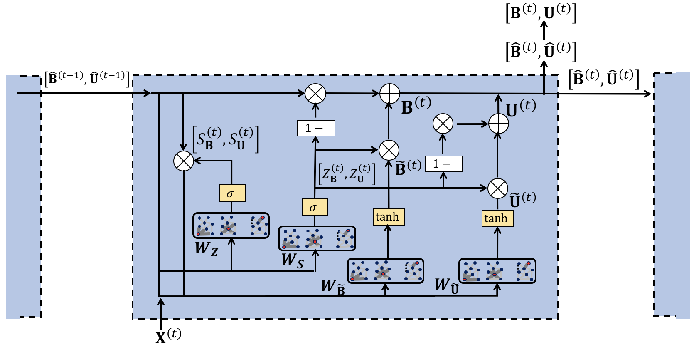

# GCN-GRU

This is a TensorFlow implementation of the GCN-GRU model as described in our paper:
 
Xujiang Zhao, Feng Chen, Jin-Hee Cho [Deep Learning for Predicting Dynamic Uncertain Opinions in Network Data], Bigdata (2018)

GCN-GRU model are end-to-end trainable deep learning models for dynamic uncertain opinions prediction in dynamic network data. 




## Installation

1. Clone this repository.
   ```sh
   git clone https://github.com/zxj32/GCN-GRU
   cd GCN-GRU
   ```

2. Install the dependencies. The code should run with TensorFlow 1.0 and newer.
   ```sh
   pip install -r requirements.txt  # or make install
   ```

## Requirements
* TensorFlow (1.0 or later)
* python 2.7
* networkx
* scikit-learn
* scipy

## Run the demo

```bash
python GCN_GRU_run.py
```
If your graph is very large, please use

```bash
python GCN_GRU_sparse.py
```
## Data

In order to use your own data, you have to provide 
* an N by N adjacency matrix (N is the number of nodes), and
* an N by L by T ground truth matrix (L is the dimension of label per node, T is time length) 
* an N by D by T feature matrix (D is the number of features per node, T is time length) -- optional (if you don't have feature, our model will use the indentity matrix as default feature)

Have a look at the `generate_train_test_epinion() or generate_train_test_epinion_sparse()` function in `read_data/read_data.py` for an example.

In this example, we load epinion data with a subgraph 500 nodes. The original datasets can be found here:http://www.trustlet.org/downloaded


## Models

For now, you can only choose the following model: 
* `GCN-GRU`: GCN_GRU_run.py
* `GCN-GRU (sparse)`: GCN_GRU_sparse.py

I will upload the other baseline models later.

## Models

If you have any question, please feel free to contact me. Email is good for me. 

## Cite

Please cite our paper if you use this code in your own work:

```
@article{xujiang2018gcn_gru,
  title={Deep Learning for Predicting Dynamic Uncertain Opinions in Network Data},
  author={Xujiang Zhao, Feng Chen and Jin-Hee Cho},
  journal={Bigdata},
  year={2018}
}
```
